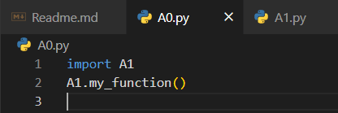
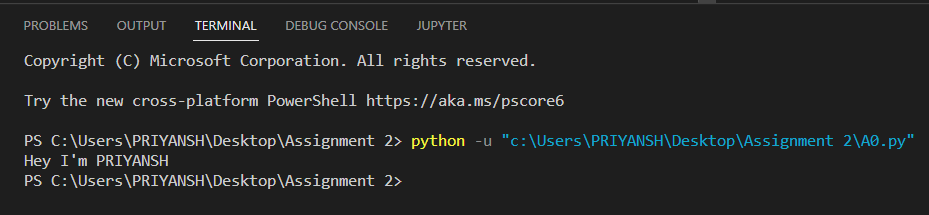

# Assignment-2: Python Basics

    Qns 1. Write a python script to add comments and print “Learning Python” on screen.

    Ans. 

    Qns 2. Write a python script to add multi line comments and print values of four variables, each in a new line. Variable contains any values.

    Ans. 

    Qns 3. Write a python script to print types of variables. Create 5 variables each of them containing different types of data. (like 35, True, “MySirG”,5.46, 3+4j, etc).

    Ans. 

    Qns 4. Write a python script to print the id of two variables containing the same integer values.

    Ans.

    Qns 5. Create four variables in a Python script and assign values of different data types to them. Write a Python script to print value, its type and id of each variable.

    Ans. 

    Qns 6. Write a python script to print all the keywords.

    Ans.

    Qns 7. On Python shell use help() function and display the list of keywords.

    Ans.

    Qns 8. Create two Python files A0.py and A1.py. Create a variable in A1.py and assign some value to it. Write a python script to import A1 module in A0 and print value of the variable created in A0.py.

    Ans.

    Qns 9. Name the keywords, used as data in the Python script.

    Ans. ???

    Qns 10. Write a python script to display the current date and time. First create variables to store date and time, then display date and time in proper format (like: 13-8-2022 and 9:00 PM).

    Ans.
